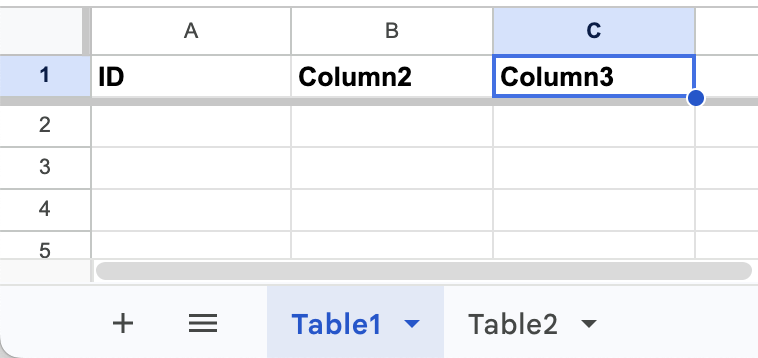
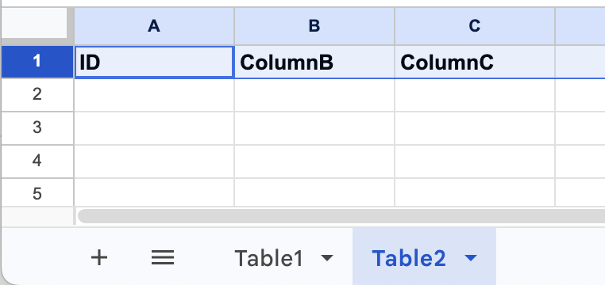
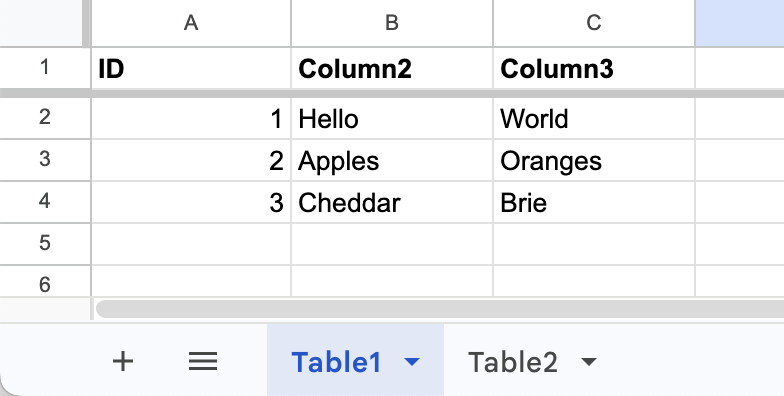
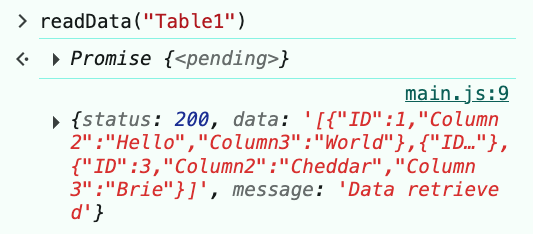
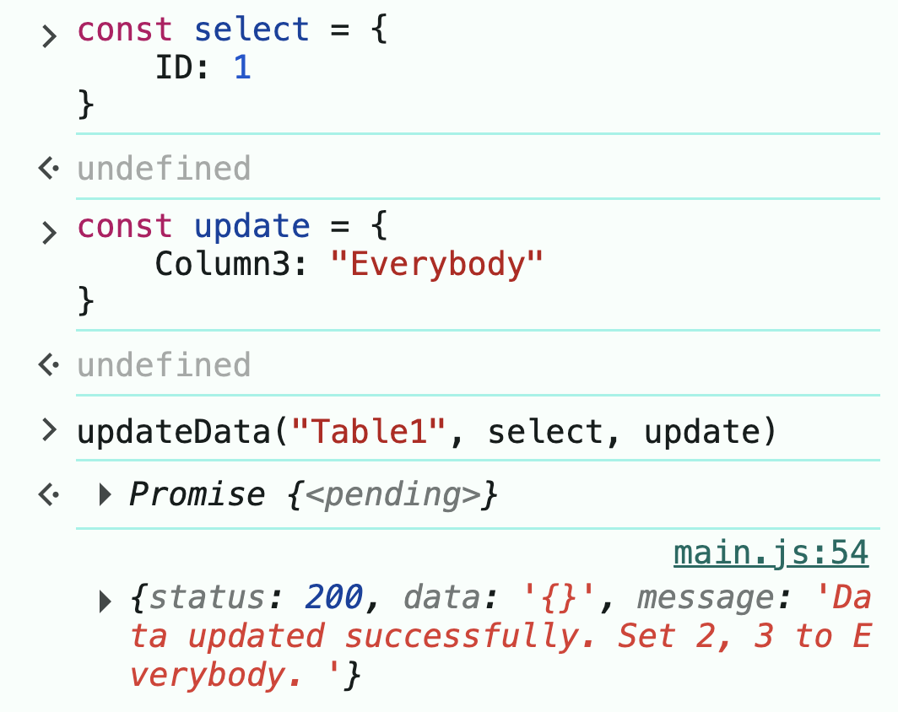
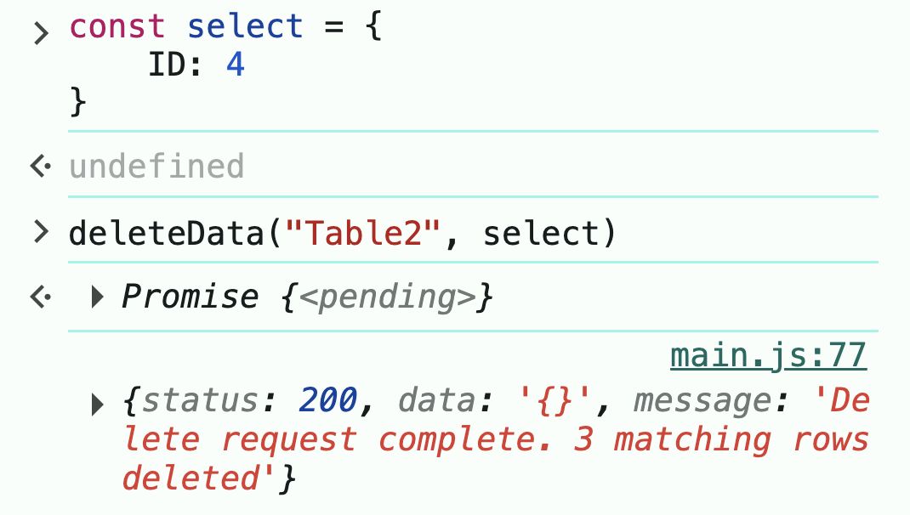

# Week 9 Practical 1: Working with the WADD remote database API
This practical will walk you through the steps required to create a remote database using Google Sheets and access it in a web project.

**If you are planning to use a remote database in your assessment:** please ensure you complete this practical in full, including the extension stages. You must follow the exact steps described in stages 1 and 2 in your assessment. You can take a different approach to communicating with the database (i.e. you can design different functions), but the structure of the requests must match those in stage 3 below.

**If you are NOT planning to use a remote database in your assessment:** you are encouraged to work through this practical to gain an understanding of the concepts. However, you can also choose to focus on planning how your assessment will make use of local data storage instead.

## Stage 1: Create the Google Sheet database
1. Open the [Google Sheet database template](https://docs.google.com/spreadsheets/d/11ponqCzadcNq9Z3bKn_oJCeVWrkKZZdP7Pt27FbdRB8/edit?gid=0#gid=0) and save a copy of it in your own Google Drive. You can change the name of the sheet to something that makes sense to you. The following steps should be carried out in your copy of the template.
2. Deploy the database as a Web App:
    1. In the Google Sheet, go to the Extensions menu and choose Apps Script. This will open some code in a new tab. 
    2. Click the blue Deploy button and select New Deployment.
    3. In the wizard, under "select type" in the left column, choose Web App.
    4. In the wizard, check the following settings:
        - Execute as: must be set to yourself.
        - Who has access: must be set to "Anyone".
    5. In the wizard, click Deploy.
    6. You will be prompted to authorize access. Follow the instructions in the wizard, granting access.
3. When deployment is complete, copy the URL under the "Web app" heading and save it somewhere e.g. in a text file. You can also find it later by opening the Apps Script (step 2.1 above), clicking Deploy > Manage Deployments, and selecting the top item under "Active".

## Stage 2: Populate your database with some placeholder data.
For the rest of these instructions, the term "database" refers to your Google Sheet. These instructions assume you know the basics of working with a Google Sheet. Ask for help if you're unsure of anything!

You are creating a relational (also known as tabular) database, so it works a little differently from the key: value datastores used in `localStorage` and `sessionStorage`.

Each tab in the Google Sheet represents one table. Depending on your data needs, one table might be enough or you can choose to have multiple tables. Currently, your database contains one table called "Table1".

1. Add a second table (a second tab) and call it "Table2".
2. In row 1 of each table, define at least 3 column headings. Each column heading should be unique within its table and it is recommend that your column names do not include spaces. Here are some examples:



3. Add at least 3 rows of data in each column in the first tab. Leave the other table empty. It doesn't matter what the data is for this exercise, but it will be easier to work with if each row is different. Here is an example:


## Stage 3: Create a web application to communicate with the database
This stage requires you to combine your knowledge of working with APIs from last practical, with your new knowledge of communicating with a database via GET and POST reqests.

1. In this repo, create a basic HTML page and an empty JavaScript file, and connect the JS file to the HTML page as usual.
2. Find your database's web app URL (stage 1, step 3) and save it in your JS file as a variable or constant. We will refer to this as the database API endpoint. You will need it for every database request.

An example:
```
const DB_ENDPOINT = "your URL here";
```
**The purpose of the rest of the stage is to practice making requests for each type of action supported by the database: create, read, update, and delete. If you're feeling confident, work out the steps using the [API documentation](https://github.com/IM-WADD/GoogleSheetDB). Otherwise, follow the steps below.**

### Exercise 3.1: Read data
1. Define an `async` function called `readData()` that has one parameter, `table`:
```
async function readData(table) {

}
```
2. In `readData()`, apply your knowledge of fetching data from an API (last practical) to request data from your database API endpoint, and print out the response. Be sure to handle possible errors by printing them. **API GET request requirements**:
    - The table you are getting data from must be specified using a URL parameter called `table` appended to the API endpoint. See the example code below. The `readData()` parameter `table` will provide the table name.
    - The JSON contents of the API response includes three useful properties: `status` provides the HTTP code indicating whether the request was successful (200 means it was OK), `message` contains the database API's summary of what happened, and  `data` is a JSON string containing the data returned from the service. Remember that fetching from an API requires two asynchronous steps. First, call `fetch()`, which returns a response object. Second, extract the JSON contents of the response. See the example code below.
```
async function readData(table) {
    try {
        // Step 1. Request data from the database
        const response = await fetch(`${DB_ENDPOINT}?table=${table}`);
        // Step 2. Convert the response to JSON format
        const data = await response.json();
        console.log(data);
    } catch (error) {
        console.error("Error fetching data:", error);
    }
}
```
3. Call the `readData()` function twice, passing in the name of each table (one containing data, one empty). You can do this in your JS file or call it from the browser console when you run your code. In the screenshot below, you can see an example of calling the function in the browser console to get data from a table called "Table1". The resulting data is also shown.


To turn the returned data into a usable JavaScript object literal, use `JSON.parse()`.

### Exercise 3.2: Add data
1. Define an async function called `addData()` that takes two parameters, `table` and `dataToAdd`.
2. In `addData()`, use `fetch()` to implement a POST request as shown in lecture (and in the example below).  **API POST request requirements**:
    - The table you are adding data to must be specified using a URL parameter called `table` appended to the API endpoint. See the example code below. The `addData()` parameter `table` will provide the table name.
    - Like all POST requests, add a second argument to your `fetch()` call: an object that includes the following key: value pairs: 
        - `method: "POST"`
        - `headers: { "Content-Type": "text/plain;charset=utf-8" }`
        - `body:` ... followed by an object containing the data expected by the API (see next bullet)
    - The object sent in the `body` must include a key, `action`, that describes what you want to do in the database. To add data, the value of `action` should be `"add"`.
    - The object sent in the `body` must include a key, `data`, that contains the data to add to the table. This data will be provided by the `dataToAdd` argument.
    - The object sent in the `body` must be in JSON format.
```
async function addData(table, dataTAdd) {
    try {
        // Step 1. Send a POST request to the database with the data to add
        const response = await fetch(`${DB_ENDPOINT}?table=${table}`, {
            method: "POST",
            headers: {
                "Content-Type": "text/plain;charset=utf-8"
            },
            body: JSON.stringify({
                action: "add",
                data: dataTAdd
            })
        });
        // Step 2. Convert the response to JSON format
        const result = await response.json();
        console.log(result);
    } catch (error) {
        console.error("Error adding data:", error);
    }
}
```
3. Next, use the `addData()` function to add data to the second table, which is currently empty. Outside of any function (either in your JS file or in the browser console), create an object literal that includes a key matching each column name in the table that you are adding data to. The API requires that you include a key: value pair for all columns in the table. Call `addData()`, passing in the table name and the object literal. Below is an example, with keys matching the columns in my "Table2":

```
const data = { 
    ID: 4, 
    ColumnB: "ABC", 
    ColumnC: "XYZ" 
}
addData("Table2", data);
```
As with `readData()` above, the response from the API is printed to the console. Check the table in your Google Sheet to confirm that the data has been added.

### Exercise 3.3: Update existing data
To update existing data, you first need to _select_ the rows you want to update and indicate which column value(s) you want to _update_.

1. Define an async function called `updateData()`, that has three parameters: `table`, `dataToSelect`, and `dataToUpdate`.
2. In `updateData()`, use `fetch()` to implement a POST request as shown in lecture (and in the example below).  **API POST request requirements:**
    - The table to update must be specified using a URL parameter called `table` appended to the API endpoint. See the example code below. The parameter `table` will provide the table name.
    - Like all POST requests, add a second argument to your `fetch()` call: an object that includes the following key: value pairs: 
        - `method: "POST"`
        - `headers: { "Content-Type": "text/plain;charset=utf-8" }`
        - `body:` ... followed by an object containing the data expected by the API (see next bullet)
    - The object sent in the `body` must include a key, `action`, that describes what you want to do in the database. To update data, the value of `action` should be `"update"`.
    - The object sent in the `body` must include a key, `data`, that contains the data required to update the table. For an update request, the `data` object must include a key called `select` with an object value describing which rows to select.  This information will be provided by the `dataToSelect` argument. The `data` object must also include a key called `update` with an object value describing the updated data. This information will be provided by the `dataToUpdate` argument.
    - The object sent in the `body` must be in JSON format.
```
async function updateData(table, dataToSelect, dataToUpdate) {
    try {
        // Step 1. Send a POST request to the database with the data to update
        const response = await fetch(`${DB_ENDPOINT}?table=${table}`, {
            method: "POST",
            headers: {
                "Content-Type": "text/plain;charset=utf-8"
            },
            body: JSON.stringify({
                action: "update",
                data: {
                    select: dataToSelect,
                    update: dataToUpdate
                }
            })
        });
        // Step 2. Convert the response to JSON format
        const result = await response.json();
        console.log(result);
    } catch (error) {
        console.error("Error updating data:", error);
    }
}
```
3. Create a JS object literal to describe which rows to select. Outside any function or in the browser console, create a variable that stores an object literal. The object should contain one or more key: value pairs where each key is a column name in the table you will update, and the value is the value to match e.g.:
```
const select = {
    ID: 1 // Search for rows where the ID value is 1
}
```
4. Create another JS object literal to describe which values to update in the selected rows. The object should contain one or more key: value pairs where each key is a column name and the value is the new value you wish to store. e.g.:
``` 
const update = {
    Column3: "Everybody"
}
```
5. Finally, call your new function, passing the table name and the new objects you created. Below is an example, which will select all rows where the ID is 1 and then change the value of Column3 to "Everybody".



Check the Google Sheet to confirm the update. _All_ rows that match the selection criteria will be update.

### Exercise 3.4: Delete rows
To update existing data, you need to _select_ the rows to be deleted in the same way that you select rows when updating data.

1. Define an async function called `deleteData()`, that has two parameters: `table` and `dataToSelect`.
2. In `deleteData()`, use `fetch()` to implement a POST request as shown in lecture (and in the example below).  **API POST request requirements:**:
    - The table you are deleting data from must be specified using a URL parameter called `table` appended to the API endpoint. See the example code below. The parameter `table` will provide the table name.
    - Like all POST requests, add a second argument to your `fetch()` call: an object that includes the following key: value pairs: 
        - `method: "POST"`
        - `headers: { "Content-Type": "text/plain;charset=utf-8" }`
        - `body:` ... followed by an object containing the data expected by the API (see next bullet)
    - The object sent in the `body` must include a key, `action`, that describes what you want to do in the database. To delete data, the value of `action` should be `"delete"`.
    - The object sent in the `body` must include a key, `data`, that contains the data required to delete data. For a delete request, the `data` object must include a key called `select` with an object value describing which rows to select for deletion.  This information will be provided by the `dataToSelect` argument. 
    - The object sent in the `body` must be in JSON format.
```
async function deleteData(table, dataToSelect) {
    try {
        // Step 1. Send a POST request to the database with the data to delete
        const response = await fetch(`${DB_ENDPOINT}?table=${table}`, {
            method: "POST",
            headers: {
                "Content-Type": "text/plain;charset=utf-8"
            },
            body: JSON.stringify({
                action: "delete",
                data: {
                    select: dataToSelect
                }
            })
        });
        // Step 2. Convert the response to JSON format
        const result = await response.json();
        console.log(result);
    } catch (error) {
        console.error("Error deleting data:", error);
    }
}
```
3. This step is the same as step 3 in 3.3 above. Create a JS object literal to describe which rows to select for deletion. Outside any function or in the browser console, create a variable that stores an object literal. The object should contain one or more key: value pairs where each key is a column name in the table you will delete, and the value is the value to match when selecting rows to delete e.g.:
```
const select = {
    ID: 4 // Search for rows where the ID value is 4
}
```
4. Finally, call your new function, passing the table name and the new object you created. Below is an example, which will delete all rows where the ID is 4.


## (Extension / FYI) Stage 4: Reverting back to an older copy of the database
During testing, you might want to roll back to an older copy of the database. To do this, use the History tool in Google Sheets.
1. Open the Google Sheet.
2. Click the History icon (a clock) to show all edits.
3. Click on a saved version to see what was changed.
4. Click the Restore this Version button to restore the saved data.

## (Extension / FYI) Stage 5: Storing image data
The database is only designed for storing data in text format. If you would like to store images or other media assets, you can store the URL of a hosted version of the asset e.g. in GitHub pages or on a file sharing site like imgur.

For images, you can also convert them to data URIs. There are many free online tools to do this. You can also easily convert images using JavaScript and an HTML canvas. [See the docs](https://developer.mozilla.org/en-US/docs/Web/API/HTMLCanvasElement/toDataURL).

## (Extension) Stage 6: Visualise database request status with animation
If you've made it this far, you've probably noticed that getting a response from the Google Sheet database is slower than most users would expect from a website. Drawing on your knowledge of finite state machines (covered in PDM 2), add animations to communicate to the user when a request is in progress. 

The states would be something like:
- idle
- loading
- success
- failure

You would need to update the state at key points in the fetch process:
- State would be idle when the page loads
- Just before calling fetch, set the state to loading
- When a response is received, set the state to success
- When an error occurs, set the state to failure

When the state is updated, change something on the page to reflect the state.
